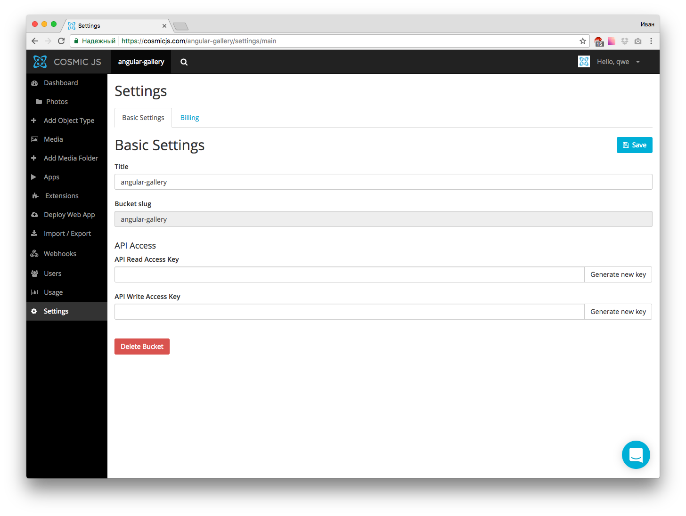
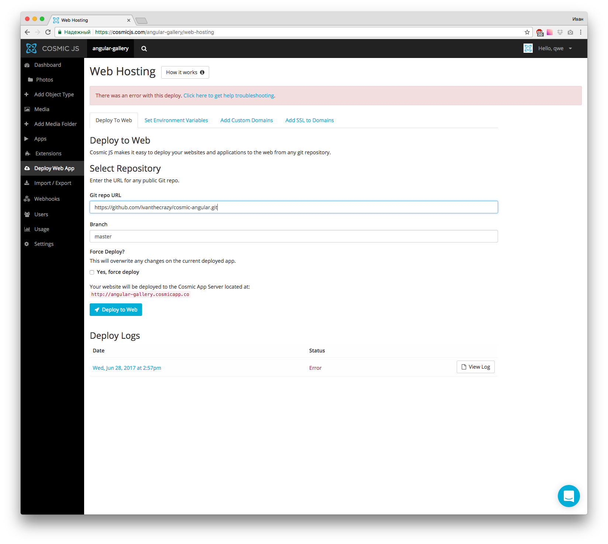

In this tutorial I’m going to show you users-driven photo gallery, which will be hosted on CosmicJS App Server.

# Prerequisites

You’ll need the node JS, npm and Angular cli pre-installed. Make sure you already have them before start. Please refer to [Angular docs](https://angular.io/guide/quickstart) how to do this. 

# Getting Started

First of all we’ll need to create the Angular project. We’ll use ng cli to do it. So once you’ll have all prerequisites installed, you’ll need to setup the new Angular project:

```bash
ng new cosmic-angular
```

After you’ll setup this project you’ll be able to run

```bash
cd cosmic-angular
ng serve --open
```

And play with your app in browser

# Doing everything using the existing git repo

First of all, you have to be sure you have node > 6.x installed, than run the following commands:

```bash
npm install -g @angular/cli
git clone git@bitbucket.org:IvanTheCrazy/cosmic-angular.git
cd cosmic-angular
npm install
ng serve --open
```
The most recent ng cli version at the article creation moment was 1.1.3.
Browser window will open automatically once you'll run the last command

# Setting up Cosmic JS library

First of all, install Cosmic JS Angular/JavaScript library

```bash
npm install cosmicjs --save
```

Now you should be able to import Cosmic object and perform Cosmic JS API calls like following:

```typescript
import Cosmic from 'cosmicjs';
const bucket = { slug: 'your-bucket-slug' };

Cosmic.getObjects({ bucket }, (err, res) => {
  console.log(res.objects);
});
```

# Setting up things with Cosmic JS

Create the bucket and remeber the bucket name (`‘cosmic-angular’` in our case):

Than create a new object type named Photo and please remember the object type slug (photos’).

We also need a way to store the picture itself. Please enter the “Metafields Template” tab and add “Image/File” type metafield with key `'photo'`. This metafield will store the image. We don’t need anything more, so just set the name and save object type.
After save you’ll be redirected to ‘New Photo’ page. Create some photos using this page and save them - we'll use them as test data.

You'll also need to create the bucket write key. It's necessary to allow users upload pictures and create photo objects. Open Settings page and click 'Generate new key' on API Write Access Key than copy generated key and save the changes.



# Angular environments

Edit the `src/environments/environment.ts` to match the following:
```typescript
export const environment = {
  production: false,
  write_key: 'YOURWRITEKEY',
  bucket_name: 'YOURBUCKETNAME',
  photos_type: 'photos'
};

```

# Configuration service for Angular

We're planning to use CosmicJS objects in more than one Angular component. In such case makes sense to create a dedicated configuration service and store all Cosmic JS related things such as bucket name, write key, etc in a single place. Let's create `src/services/cosmic_config.ts` with the following contents:

```typescript
import {Injectable} from '@angular/core';

@Injectable()
export class CosmicConfigService {
    private write_key;
    private bucket_name;
    private photos_type;

    constructor() {
        this.photos_type = environment.photos_type;
        this.write_key = environment.write_key;
        this.bucket_name = environment.bucket_name
    }

    public getReadCfg(): any {
        return {
            bucket: {
                slug: this.bucket_name
            }
        };
    }

    public getWriteCfg(): any {
        return {
            bucket: {
                slug: this.bucket_name,
                write_key: this.write_key
            }
        };
    }

    public buildPhotoUploadObj(title, file): any {
        return {
            write_key: this.write_key,
            type_slug: this.photos_type,
            title: title,
            metafields: [{
                key: 'picture',
                type: 'file',
                value: file
            }]
        };
    }

    getPhotoSlug() {
        return this.photos_type;
    }
}
```

This service has a few methods:

* `getReadCfg` - returns config object for reading data
* `getWriteCfg` - return config object for writing data (with write_key specified)
* `buildPhotoUploadObj` - builds object to create photo using file name and title
* `getPhotoSlug` - returns object type slug for photos

We'll call these methods from our Angular components.

# View the gallery - Angular part

Create `src/components/picture/picture.ts` file with the following content:

```typescript
import { Component, Input } from '@angular/core';

@Component({
    selector: 'picture',
    templateUrl: './picture.html'
})
export class Picture {
    @Input() picture: any;

    constructor() {
    }
}
```

Than create a template for Picture component: 

```html
<div class="ui card picture-item">
  <div class="image">
    
  </div>
  <div class="content">
    <div class="description">{{ picture.title }}</div>
  </div>
</div>
```

We'll use this component to display a single gallery picture item.

Now create `src/components/picture_upload/picture_upload.ts` file with the following content:

```typescript
import { Component, Input, Output, EventEmitter } from '@angular/core';
import Cosmic from 'cosmicjs';
import { CosmicConfigService } from '../../services/cosmic_config';

@Component({
    selector: 'picture-upload',
    templateUrl: './picture_upload.html'
})
export class PictureUpload {
    private fl;
    private title;
    public uploading;
    @Output() onUpload = new EventEmitter<any>();

    constructor(
        private cosmicConfig: CosmicConfigService
    ) {
        this.uploading = false;
        this.fl = null;
        this.title = "";
    }

    onFileChange(ev) {
        if (ev.target.files && ev.target.files.length) {
            this.fl = ev.target.files[0];
        }
    }

    upload() {
        this.uploading = true;
        Cosmic.addMedia(this.cosmicConfig.getWriteCfg(), {
            media: this.fl,
            folder: this.fl.name
        }, (error, response) => {
            Cosmic.addObject(this.cosmicConfig.getWriteCfg(),
                this.cosmicConfig.buildPhotoUploadObj(this.title, response.body.media.name),
            (error, response) => {
                this.title = '';
                this.fl = null;
                this.uploading = false;
                this.onUpload.emit({});
            });
        });
    }
}
```

Than add the following template:

```html
<div class="picture-upload">
    <div class="ui form" [ngClass]="{ 'active dimmer': uploading }">
        <div class="ui grid" *ngIf="!uploading">
            <div class="five wide column">
                <div class="field">
                    <input type="text" placeholder="Title..." (input)="title = $event.target.value" [value]="title"/>
                </div>
            </div>
            <div class="six wide column">
                <div class="field">
                    <input type="file" (change)="onFileChange($event)"/>
                </div>
            </div>
            <div class="five wide column">
                <button class="ui primary button fluid" (click)="upload()">Upload photo</button>
            </div>
        </div>
        <div *ngIf="uploading" class="ui text loader">Upload is in progress</div>
    </div>
</div>
```

Add `Picture` and `PictureUpload` components to app.module.ts as it’s done with other components like AppComponent. This will allow us to use it in our app.

## What happens here?

Our `Picture` component doesn't perform anything interesting - it just displays object properties. However `PuctureUpload` component doing much more interesting thing. It creates a record on CosmicJS servers, but this record has an image attached, so this makes the whole process more complicated:

* upload the image to CosmicJS servers (using `addMedia` method)
* obtain uploaded image name
* create the new CosmicJS object (using `addObject` method) passing it obtained image name
* fire an event to notify parent component about finished upload

# Concatenating everything together

Now we need to modify our `AppComponent` to use these newly created components. Modify `src/app/app.component.ts` to look like the following:

```typescript
import { Component } from '@angular/core';
import Cosmic from 'cosmicjs';
import {CosmicConfigService} from '../services/cosmic_config';

@Component({
  selector: 'app-root',
  templateUrl: './app.component.html',
  styleUrls: ['./app.component.css']
})
export class AppComponent {
  public items = [];
  page = 0;
  page_size = 2;
  scrollEnabled = true;

  constructor(
    public cosmicCfg: CosmicConfigService
  ) {
    this.reload();
  }

  reload() {
    this.items = [];
    this.page = 0;
    this.scrollEnabled = true;
    let params = {
      type_slug: this.cosmicCfg.getPhotoSlug(),
      limit: this.page_size,
      skip: 0
    };
    Cosmic.getObjectType(this.cosmicCfg.getReadCfg(), params, (err, res) => {
      this.items = res.objects.all;
    });
  }

  onUpload() {
    this.reload();
  }

  onScroll() {
    if (!this.scrollEnabled) {
      return;
    }
    this.page++;
    let params = {
      type_slug: this.cosmicCfg.getPhotoSlug(),
      limit: this.page_size,
      skip: this.page * this.page_size
    };
    Cosmic.getObjectType(this.cosmicCfg.getReadCfg(), params, (err, res) => {
      if (res.objects && res.objects.all) {
        res.objects.all.forEach((itm) => {
          this.items.push(itm);
        });
      }
      else {
        this.scrollEnabled = false;
      }
    });
  }
}
```

And make its template like following:

```html
<div infiniteScroll [infiniteScrollDistance]="1" [infiniteScrollThrottle]="300" (scrolled)="onScroll()">
    <picture-upload (onUpload)="onUpload()"></picture-upload>
	<picture *ngFor="let item of items" [picture]="item"></picture>	
</div>
```

We're planning to have the infinite-scrollable gallery (and you can already see it's directives in code). This means we have to install the right library:

```bash
npm install --save ngx-infinite-scroll
```

## What’s happening here?

* until we got empty response, we're assuming there are more photos on server
* we're fetching photos in bulks of 2 (`page_size` property)
* we're fetching only 'photo' type objects (this is useful in case if we have more object types)
* once we got empty response, we're setting the flag and stopping try to fetch more photos
* once we're getting an event from `PhotoUpload` component, we're resetting the whole list.

# Deploy to CosmicJS servers

CosmicJS has some requirements for deploying apps:

* it must be in public git repo
* [Specific requirements](https://devcenter.heroku.com/) depending on your platform must be met

In our case we actually have HTML5 app, so we'll need some additional software.

## Prepare config

Create a `prepare.js` file in your project directory:
```javascript
var fs = require('fs');

var str = `
    export const environment = {
        production: true,
        write_key: '${process.env.COSMIC_WRITE_KEY}',
        bucket_name: '${process.env.COSMIC_BUCKET}',
        photos_type: 'photos'
    };
`;
fs.writeFile("./src/environments/environment.prod.ts", str, function(err) {
    if(err) {
        return console.log(err);
    }
    console.log("The file was saved!");
}); 
```

This script will rewrite default Angular production settings file to use your CosmicJS bucket write key and bucket name.

## Modify package.json

Angular cli adds some packaged on `package.json` as `devDependencies`. We have to move them in `dependencies` to make our scripts work:

```json
...
"dependencies": {
    "@angular/cli": "^1.1.3",
    "@angular/compiler-cli": "^4.0.0",
    ...
},
...
```

## Prepare software

We'll also need something to serve our Angular app. We'll use Express framework:

```bash
npm install --save express
```

Add the following to your package.json:

```json
{
  ...
  "scripts": {
    ...
    "start": "node app.js"
  },
  ...
  "engines": {
    "node": "6.9.4",
    "npm": "4.2.0"
  }
  ...
}
```

The main point is to have `start` command defined in the `scripts` section (you can safely replace default angular `start` command). This is the command which will be run to start our app. So now we have the only thing left - create the `app.js` file:

```JavaScript
const express = require('express')
const app = express()

app.use(express.static('./dist'));

app.listen(process.env.PORT, function () {
});
```

This is a simple Express app which serves `dist` dir as dir of static files. Please take note - app listens on port specified via `PORT` environment variable, it's important to run apps on CosmicJS App Server.

## Build Angular app for production

We'll use `app.json` to do this (dokku `predeploy` section):

```json
{
    "scripts": {
        "dokku": {
            "predeploy": "node prepare.js && ng build --aot --prod"
        }
    }
}
```

This script will be executed before we'll launch our express app to build the Angular app for production.

## Run it!

Now you can enter 'Deploy Web App' page in your CosmicJS Dashboard.



Simply enter your repo URL and click 'Deploy to Web' - deploy process will be started and app become ready in a couple of minutes.

# Conclusion

Using Cosmic JS App Server allows quickly deploy the application to hosting using a git repo and don't worry about server configuration and software installation - everything will be done by CosmicJS servers.